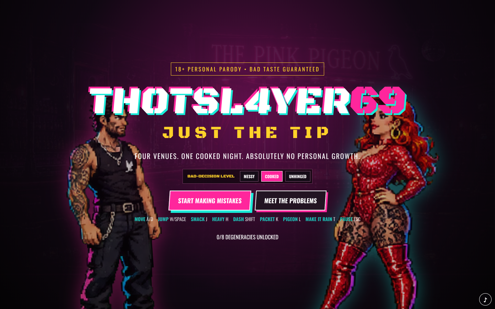
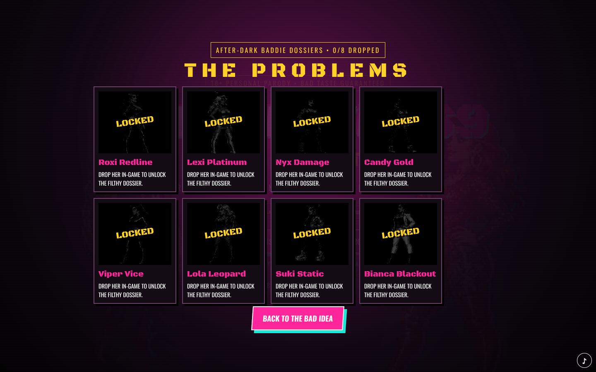
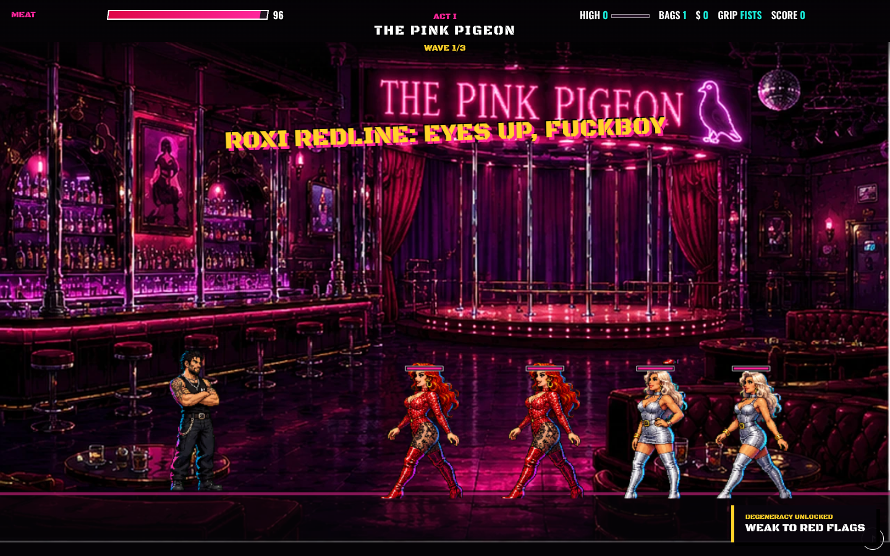
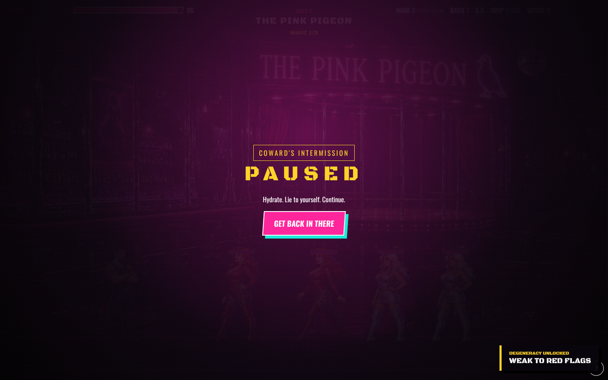
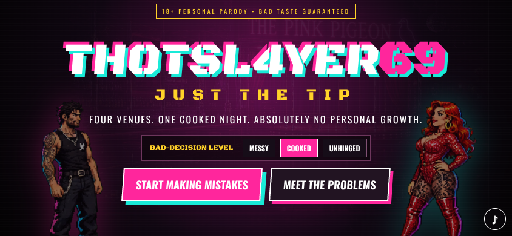
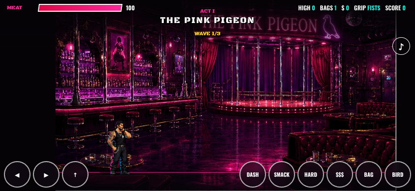

# Browser playtest report

Tested against the production Vite build in headless Chromium on desktop (1440×900) and mobile landscape (844×390).

## Result

**PASS** — both automated browser journeys passed. Title, difficulty selection, eight-card dossier gallery, game start, movement, attacks, packet/pigeon actions, HUD, pause/resume, responsive touch controls and production asset requests all completed without page errors, console errors, failed requests or horizontal overflow.

## Defects found and fixed

1. **Ghost opening wave:** the simulation advanced an empty wave behind the title screen before a run began. Starting the game then activated both the stale timer and the intended timer. Simulation is now gated by an explicit run lifecycle and the player entity remains inactive behind the menu.
2. **Excessive HUD work:** gameplay rewrote the complete DOM HUD every render frame. HUD emission is now throttled to 10 Hz while critical events still update immediately.
3. **Mobile action collision:** the mute button overlapped the pigeon control in landscape. In-game mobile mute placement and compact touch sizing now preserve all nine controls.
4. **Weak combat-state feedback:** HIGH now has a visual meter and player aura; weapon grip is visible; takedowns produce score popups; enemy engagement spacing and spawn formation were improved.
5. **Stale installed build risk:** the service worker now uses a versioned cache and network-first navigation so updates are not trapped behind an old app shell.

## Performance note

The CPU-only SwiftShader browser used for automated visual testing sampled roughly 20–22 animation frames per second after the HUD optimisation, versus roughly 17 before it. This constrained software-rendering result is useful for regression comparison but is not a hardware-GPU benchmark.

## Visual evidence

### Desktop title

### Dossier gallery

### Authored four-enemy opening wave

### Pause and recovery

### Mobile landscape

